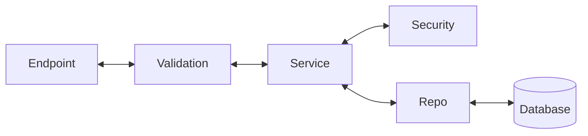
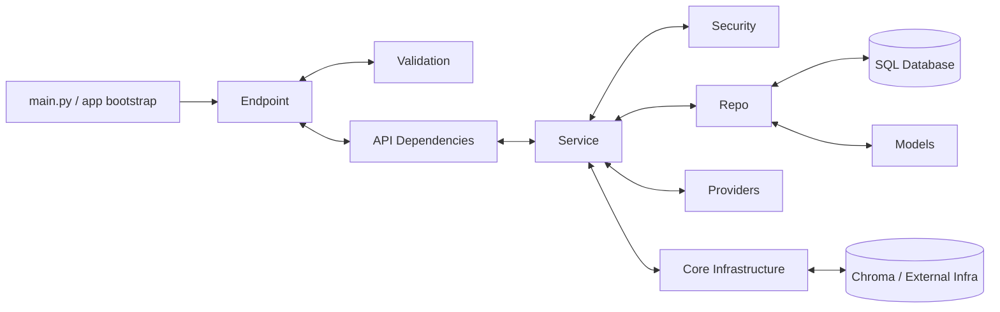

# Backend Architecture Skill

This skill defines the architectural layers of the backend and the rules for their communication. It ensures that any agent working on the codebase understands where specific logic should reside.

## Architectural Layers

The backend follows a strict layered architecture:

### 1. Endpoint Layer
- **Responsibility**: Handles incoming HTTP requests and returns HTTP responses.
- **Rules**:
    - Should only call the **Service Layer**.
    - Should not contain business logic or direct database queries.
    - Handles status codes and route definitions.

### 2. Validation Layer
- **Responsibility**: Defines the data schemas (e.g., Pydantic models) and validates input/output.
- **Rules**:
    - Holds schemas that define what the data between the frontend and backend looks like.
    - Performs basic checks like email format, password length, and field requirements.

### 3. Service Layer
- **Responsibility**: Implements the core business logic.
- **Examples**:
    - Checking if an email already exists.
    - Password hashing and verification.
    - Token generation (JWT).
- **Rules**:
    - Calls the **Repo Layer** for data persistence.
    - Orchestrates multi-step business processes.
    - Should not contain direct SQL or database-specific queries.

### 4. Repo Layer
- **Responsibility**: Abstraction for database operations.
- **Rules**:
    - Holds all database query calls.
    - Should only be called by the **Service Layer**.
    - Should be the only layer aware of the database schema and query language (SQL/ORM).

## Repository-Specific Context

This repository generally follows the Endpoint -> Validation -> Service -> Repo
pattern, but the real codebase includes several supporting layers that future
agents must understand before making architectural changes.

### Actual Backend Shape In This Repo

In practice, the backend is organized like this:

### Additional Layers Present In This Repo

#### 1. Core Layer
- **Location**: `backend/src/core/`
- **Responsibility**: Shared infrastructure and application wiring.
- **Examples**:
    - Database engine and session management in `database.py`
    - App settings in `config.py`
    - Logging helpers in `logger.py`
    - Chroma connection management in `chroma.py`
- **Rules**:
    - This is infrastructure, not business logic.
    - Services may depend on core infrastructure helpers.
    - Endpoints may depend on core wiring helpers only for dependency injection.

#### 2. Security Layer
- **Location**: `backend/src/security/`
- **Responsibility**: Authentication and cryptographic helpers.
- **Examples**:
    - JWT encode/decode and current-user extraction
    - Password hashing and verification
- **Rules**:
    - Services may call security helpers for auth-related business flows.
    - Keep cryptographic concerns here rather than duplicating them in services or endpoints.

#### 3. Providers Layer
- **Location**: `backend/src/providers/`
- **Responsibility**: External AI model provider dispatch and adapters.
- **Examples**:
    - Groq, Gemini, DeepSeek, and mock provider streaming
    - Provider validation and dispatch
- **Rules**:
    - Treat providers as infrastructure adapters for external LLM systems.
    - Business orchestration should stay in services, while provider-specific API behavior stays here.

#### 4. Models Layer
- **Location**: `backend/src/models/`
- **Responsibility**: SQLAlchemy ORM definitions for persistent entities.
- **Rules**:
    - Repos are the main consumers of ORM models.
    - Models define persistence shape, not request/response contracts.
    - Do not treat ORM models as validation schemas for API boundaries.

#### 5. API Dependency Layer
- **Location**: `backend/src/api/dependencies/`
- **Responsibility**: FastAPI dependency wiring that keeps endpoint modules thinner.
- **Rules**:
    - This layer is allowed to construct services and infrastructure dependencies.
    - It exists to keep route handlers focused on HTTP concerns.

## Workflow for New Features
1. Define the **Validation** schemas.
2. Define the **Repo** methods for data access.
3. Implement business logic in the **Service** layer.
4. Create the **Endpoint** to expose the feature.

## How To Interpret The Current Repo

Use the simple 4-layer model as the default mental model, but adapt it to the
actual repo structure:

- **Auth flow**: Endpoint -> Service -> Repo + Security
- **Chat flow**: Endpoint -> Service -> Repo + Providers + RAG Service
- **RAG flow**: Endpoint -> Service -> Core Chroma infrastructure

The RAG feature is intentionally different from the SQL-backed features:

- It does not currently have a dedicated `repo/` module.
- `RAGService` talks to `ChromaManager` in `core/` as an infrastructure adapter.
- This means RAG currently behaves more like `Service -> Infrastructure` than
  `Service -> Repo`.

## Guardrails For Future Agents

When changing backend code in this repository:

1. Default to the layered architecture first.
2. Preserve the existing supporting layers (`core`, `security`, `providers`,
   `models`, `api/dependencies`) instead of collapsing them into the original
   4-layer diagram.
3. Put business rules in services, not endpoints.
4. Put SQLAlchemy queries and persistence logic in repos.
5. Put request/response contracts in schemas.
6. Put external provider integration details in `providers/`.
7. Put shared infrastructure setup in `core/`.

## Known Boundary Deviations In The Current Codebase

These patterns exist in the repo today. Treat them as important context rather
than as ideal defaults to expand further.

### Accepted / Understandable Deviations
- Endpoints currently construct services with repositories through dependency
  injection factories. This is acceptable in FastAPI for thin wiring.
- Security utilities are a dedicated supporting layer used by services.
- RAG currently uses core-managed Chroma infrastructure directly instead of a
  dedicated repo abstraction.

### Deviations Future Agents Should Be Careful About
- Avoid adding more endpoint logic that reaches into provider or low-level
  service internals.
- Avoid bypassing service public APIs from endpoints when a service method would
  be more appropriate.
- Avoid making security helpers the default place for broader business logic.
- Avoid spreading database access outside repo modules unless there is a very
  strong architectural reason.

## Preferred Direction For New Work

When adding new features, prefer this order:

1. Add or update schemas.
2. Add or update repo methods if SQL persistence is involved.
3. Add or update service logic.
4. Add endpoint wiring.
5. Add provider/core/security support only when the feature truly needs it.

For AI-related features, it is acceptable for services to orchestrate across:

- repos for SQL persistence
- providers for LLM calls
- core infrastructure for shared system resources such as Chroma

The key rule is that orchestration belongs in the service layer, while transport,
storage, and vendor-specific details stay in their respective support layers.
