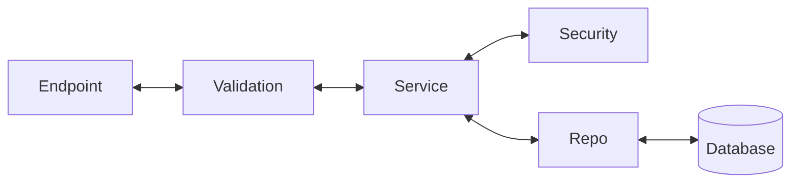

# Backend Architecture Skill

This skill defines the architectural layers of the backend and the rules for their communication. It ensures that any agent working on the codebase understands where specific logic should reside.

## Architectural Layers

The backend follows a strict layered architecture:

### 1. Endpoint Layer
- **Responsibility**: Handles incoming HTTP requests and returns HTTP responses.
- **Rules**:
    - Should only call the **Service Layer**.
    - Should not contain business logic or direct database queries.
    - Handles status codes and route definitions.

### 2. Validation Layer
- **Responsibility**: Defines the data schemas (e.g., Pydantic models) and validates input/output.
- **Rules**:
    - Holds schemas that define what the data between the frontend and backend looks like.
    - Performs basic checks like email format, password length, and field requirements.

### 3. Service Layer
- **Responsibility**: Implements the core business logic.
- **Examples**:
    - Checking if an email already exists.
    - Password hashing and verification.
    - Token generation (JWT).
- **Rules**:
    - Calls the **Repo Layer** for data persistence.
    - Orchestrates multi-step business processes.
    - Should not contain direct SQL or database-specific queries.

### 4. Repo Layer
- **Responsibility**: Abstraction for database operations.
- **Rules**:
    - Holds all database query calls.
    - Should only be called by the **Service Layer**.
    - Should be the only layer aware of the database schema and query language (SQL/ORM).

## Workflow for New Features
1. Define the **Validation** schemas.
2. Define the **Repo** methods for data access.
3. Implement business logic in the **Service** layer.
4. Create the **Endpoint** to expose the feature.
