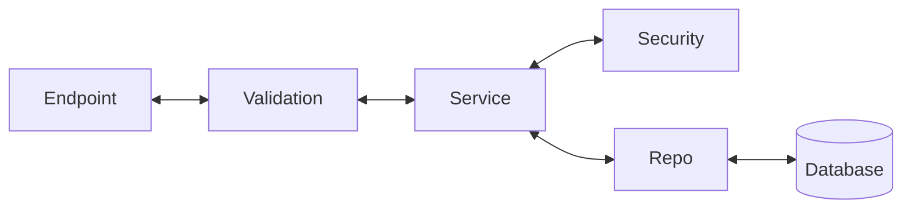

# Backend Project

## Description
A Python backend application.

## Setup

### Prerequisites
- Python 3.11+
- Docker (optional)

### Local Development

1. Create and activate virtual environment:
```bash
source venv/bin/activate  # On Unix/macOS
# or
venv\Scripts\activate  # On Windows
```

2. Install dependencies:
```bash
pip install -r requirements.txt
```

3. Run the application:
```bash
python main.py
```

### Docker

1. Build the Docker image:
```bash
docker build -t backend-app .
```

2. Run the container:
```bash
docker run -p 8000:8000 backend-app
```

## Project Structure
```
.
├── Dockerfile
├── README.md
├── requirements.txt
├── venv/
└── main.py
```

## Back in Architecture



*   **Endpoint**: What the front end requests when it hits the back end.
*   **Validation Layer**: The layer that holds all the schemas that define what the output between the front end and back end should look like. Validation happens here, like checking if a password or email is valid.
*   **Service Layer**: Performs the business logic, such as checking if an email already exists in the database, handling password hashing, or creating JSON Web Tokens (JWT).
*   **Repo Layer**: The layer that holds all the database query calls that the service layer calls when it needs to make a database call.

## Environment Variables
Configure your environment variables in a `.env` file (not tracked in git).

## License
MIT
