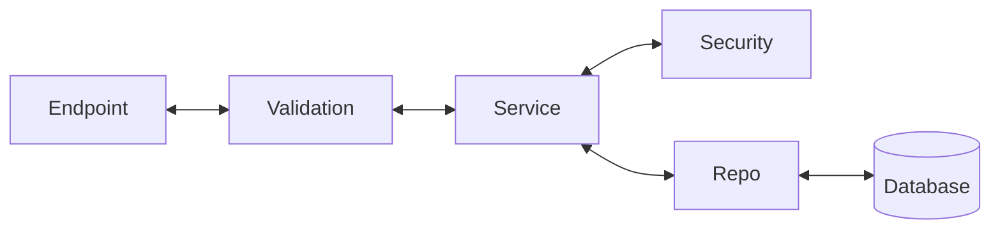

# Backend Project

## Description
A Python backend application.

## Setup

### Prerequisites
- Python 3.11+
- Docker (optional)


```markdown
> **Note:** Make sure that your VS Code window is opened in the `backend` directory, not the root directory of the entire project.
```


### Local Development

1. Create a virtual environment:
```bash
python3 -m venv venv
```

2. Activate the virtual environment:
```bash
source venv/bin/activate  # macOS / Linux
venv\Scripts\activate     # Windows
```

3. Install dependencies:
```bash
pip install -r requirements.txt
```

4. Run the application:
```bash
uvicorn src.main:app --reload
```

The API will be available at `http://localhost:8000`.
Interactive docs (Swagger UI): `http://localhost:8000/docs`

### Docker

1. Build the Docker image:
```bash
docker build -t aegisai-backend .
```

2. Run the container:
```bash
docker run -p 8000:8000 aegisai-backend
```

## Project Structure
```
.
├── Dockerfile
├── README.md
├── requirements.txt
├── venv/
└── main.py
```

## Backend Architecture



*   **Endpoint**: What the front end requests when it hits the back end.
*   **Validation Layer**: The layer that holds all the schemas that define what the output between the front end and back end should look like. Validation happens here, like checking if a password or email is valid.
*   **Service Layer**: Performs the business logic, such as checking if an email already exists in the database, handling password hashing, or creating JSON Web Tokens (JWT).
*   **Repo Layer**: The layer that holds all the database query calls that the service layer calls when it needs to make a database call.

## Database Connection

> **Prerequisites:** Docker must be installed and running.

### Start the Test Database

1. Build the image:

   **From the project root:**
   ```bash
   docker build -f db/Dockerfile.test -t aegisai-db-test db/
   ```

   **From the `backend` folder:**
   ```bash
   docker build -f ../db/Dockerfile.test -t aegisai-db-test ../db/
   ```

2. Start the container:
```bash
docker run -d --name aegisai-db-test-container -p 5433:5432 aegisai-db-test
```

This exposes Postgres on `localhost:5433` (avoids clashing with a local Postgres on 5432).

### Connect & Verify

3. Connect via Docker exec:
```bash
docker exec -it aegisai-db-test-container psql -U test_admin -d aegis_test_db
```

Or connect from the host if you have `psql` installed:
```bash
psql -h localhost -p 5433 -U test_admin -d aegis_test_db
```

Connection details:
| Field    | Value            |
|----------|------------------|
| Host     | localhost        |
| Port     | 5433             |
| Database | aegis_test_db    |
| User     | test_admin       |
| Password | test_password    |

4. Verify the schema was applied:
```sql
\dt                   -- should list the 'users' table
SELECT * FROM users;  -- should return an empty table
```

### Tear Down

5. Stop and remove the container when done:
```bash
docker rm -f aegisai-db-test-container
```

## Environment Variables
Configure your environment variables in a `.env` file (not tracked in git).

## License
MIT
