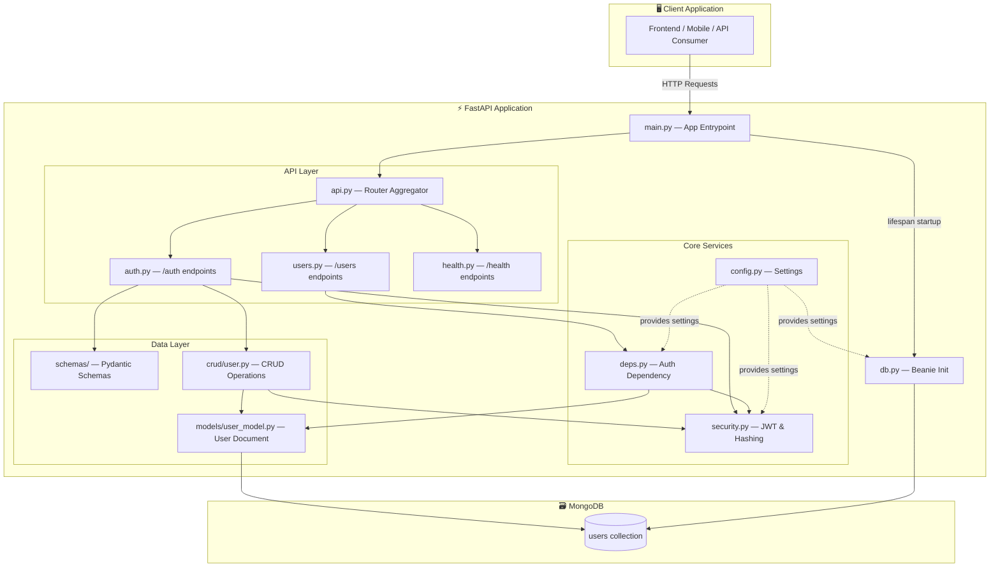
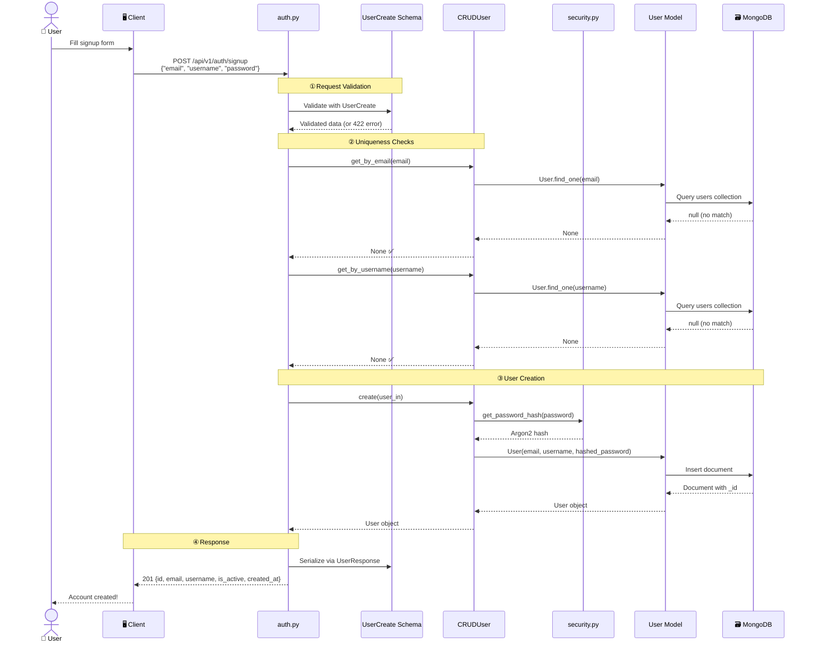
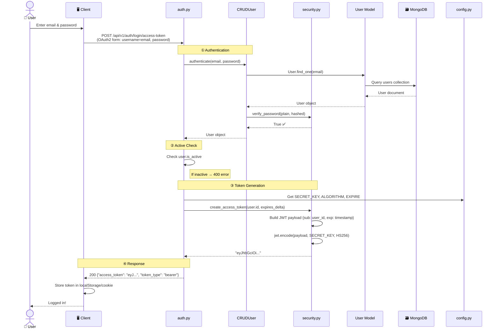
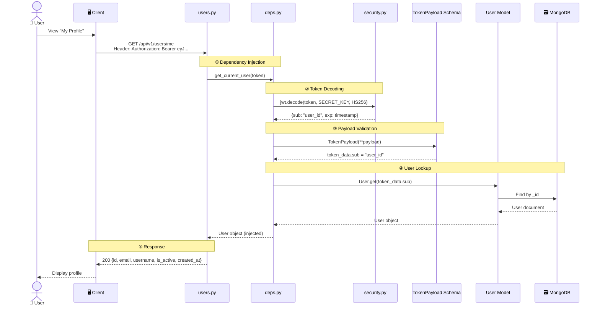
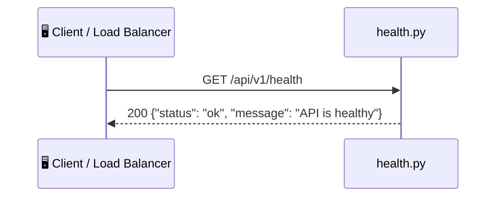
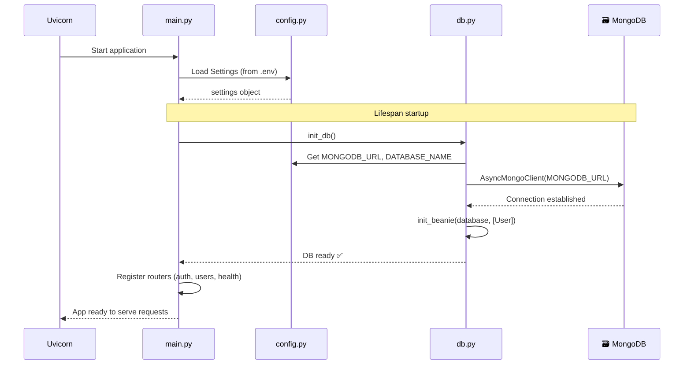

# AegisAI Backend

The AegisAI backend is a **FastAPI** application using **MongoDB** (via the **Beanie** ODM) for persistence, **JWT tokens** for stateless authentication, and **Argon2** for password hashing. It follows a clean **layered architecture** that separates concerns across API routing, schemas, CRUD operations, models, and core services.

---

## Project Structure

```
backend/
├── main.py                          # App entrypoint & lifespan (DB init)
├── requirements.txt                 # Python dependencies
├── Dockerfile                       # Container build (Python 3.11)
├── docker-compose.test.yml          # Test env (MongoDB + pytest)
├── .env                             # Environment variables
│
├── src/
│   ├── core/                        # ⚙️ Core services
│   │   ├── config.py                # Settings (Pydantic-Settings)
│   │   ├── db.py                    # MongoDB / Beanie init
│   │   └── security.py              # JWT creation, password hashing
│   │
│   ├── models/                      # 📦 Database models
│   │   └── user_model.py            # User document (Beanie Document)
│   │
│   ├── schemas/                     # 📋 Request/Response schemas
│   │   ├── users.py                 # UserCreate, UserUpdate, UserResponse
│   │   ├── token.py                 # Token, TokenPayload
│   │   └── auth.py                  # (placeholder)
│   │
│   ├── crud/                        # 🗄️ Data-access layer
│   │   └── user.py                  # CRUDUser (create, get, authenticate)
│   │
│   └── api/                         # 🌐 API layer
│       ├── deps.py                  # Dependencies (get_current_user)
│       └── v1/
│           ├── api.py               # Router aggregator
│           └── endpoints/
│               ├── auth.py          # POST /signup, POST /login
│               ├── users.py         # GET /users/me
│               └── health.py        # GET /health
│
└── tests/
    └── test_users.py                # Integration tests (Beanie + User)
```

---

## Architecture



---

## User Flows

### 1. Signup — `POST /api/v1/auth/signup`

A new user creates an account by submitting email, username, and password.



| Step | Component | What It Does |
|------|-----------|-------------|
| ① | `UserCreate` schema | Validates email format, requires username & password |
| ② | `CRUDUser.get_by_email/username` | Queries MongoDB to ensure no duplicate email or username (400 if found) |
| ③ | `security.get_password_hash` → `User.insert` | Hashes password with Argon2, creates Beanie Document, inserts into MongoDB |
| ④ | `UserResponse` schema | Serializes the User document, maps `_id` → `id`, strips `hashed_password` |

---

### 2. Login — `POST /api/v1/auth/login/access-token`

An existing user authenticates and receives a JWT access token.



| Step | Component | What It Does |
|------|-----------|-------------|
| ① | `CRUDUser.authenticate` | Looks up user by email, verifies plain password against Argon2 hash |
| ② | `auth.py` | Checks `is_active` flag — inactive users get a 400 response |
| ③ | `security.create_access_token` | Creates JWT with `sub` (user ID) and `exp` (7-day expiry), signs with HS256 |
| ④ | Response | Returns the bearer token for the client to store and attach to future requests |

---

### 3. Authenticated Request — `GET /api/v1/users/me`

A logged-in user retrieves their own profile using the stored JWT.



| Step | Component | What It Does |
|------|-----------|-------------|
| ① | FastAPI `Depends()` | Automatically calls `get_current_user` before the endpoint runs |
| ② | `jose.jwt.decode` | Decodes the JWT, verifying signature and expiration (403 if invalid) |
| ③ | `TokenPayload` schema | Validates the decoded payload structure, extracting `sub` (user ID) |
| ④ | `User.get()` | Fetches the full User document from MongoDB by ID (404 if not found) |
| ⑤ | `UserResponse` schema | Serializes the User document for the client, excluding sensitive fields |

---

### 4. Health Check — `GET /api/v1/health`



No authentication or database access required.

---

### 5. Application Startup



---

## Component Summary

| Layer | File(s) | Responsibility |
|-------|---------|----------------|
| **Entrypoint** | `main.py` | Creates FastAPI app, wires lifespan DB init, registers the v1 router |
| **Config** | `src/core/config.py` | Loads settings from `.env` via Pydantic-Settings (DB URL, JWT secret, token expiry) |
| **Database** | `src/core/db.py` | Initializes the async Mongo connection and Beanie ODM with registered document models |
| **Security** | `src/core/security.py` | Creates JWT tokens (`python-jose`), hashes and verifies passwords (`Argon2`) |
| **Models** | `src/models/user_model.py` | Beanie `Document` subclass mapping to the `users` MongoDB collection |
| **Schemas** | `src/schemas/users.py`, `src/schemas/token.py` | Pydantic models for request validation and response serialization |
| **CRUD** | `src/crud/user.py` | Data-access class with `create`, `get_by_email`, `get_by_username`, `authenticate` |
| **Dependencies** | `src/api/deps.py` | FastAPI dependency `get_current_user` — decodes JWT, fetches user from DB |
| **Endpoints** | `src/api/v1/endpoints/auth.py`, `users.py`, `health.py` | Route handlers for auth, user profile, and health check |
| **Infrastructure** | `Dockerfile`, `docker-compose.test.yml` | Container build and test orchestration |
| **Tests** | `tests/test_users.py` | Integration tests for Beanie init and user CRUD |
